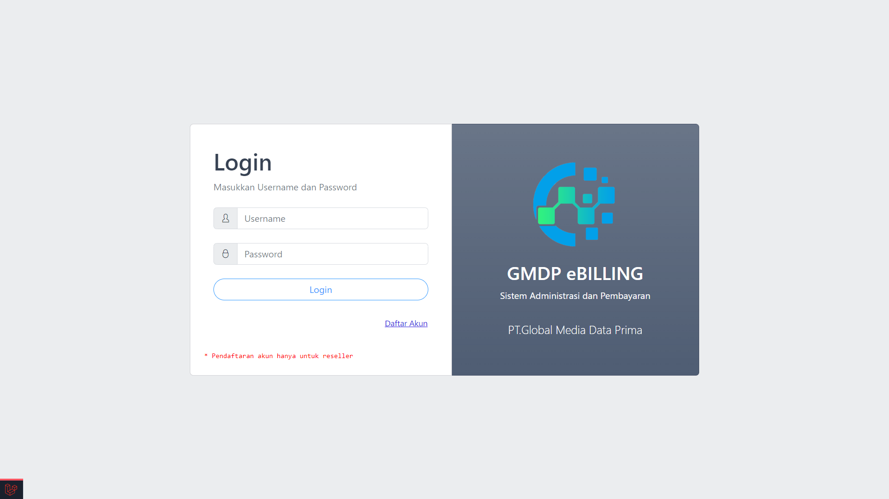
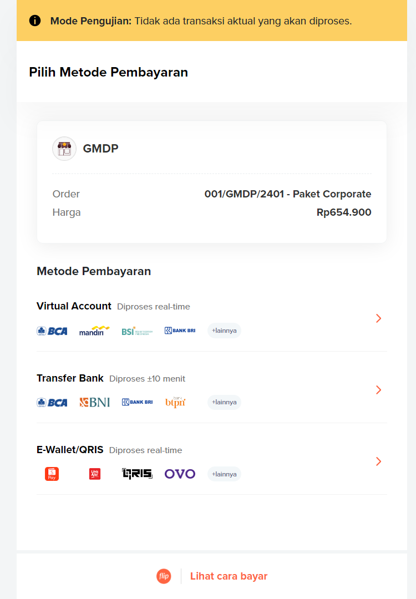
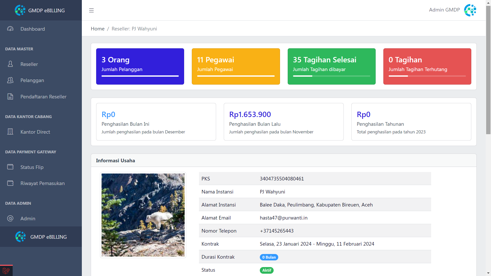
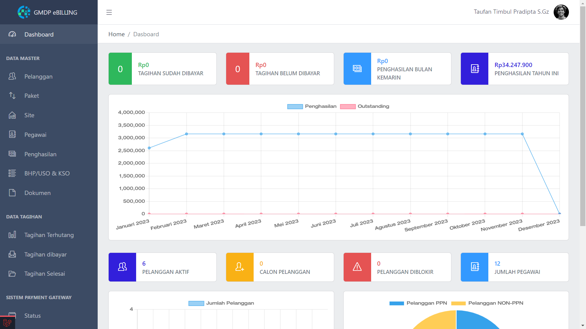
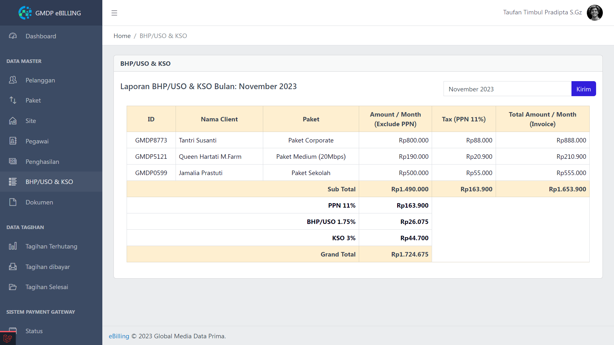
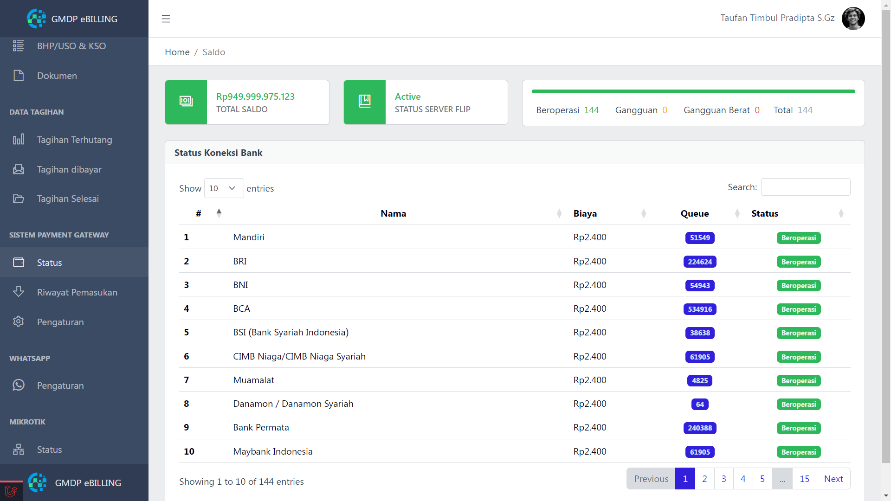
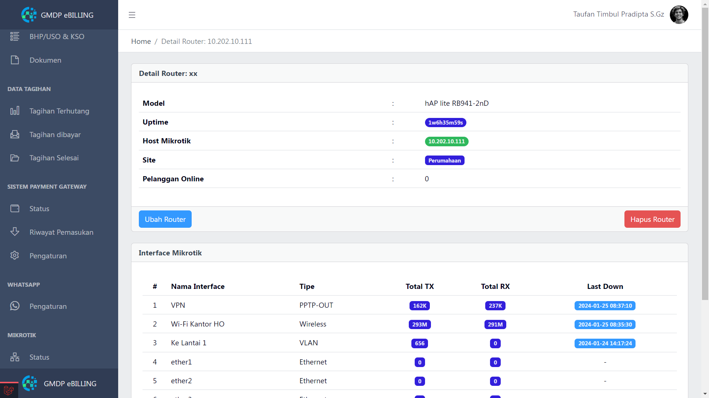
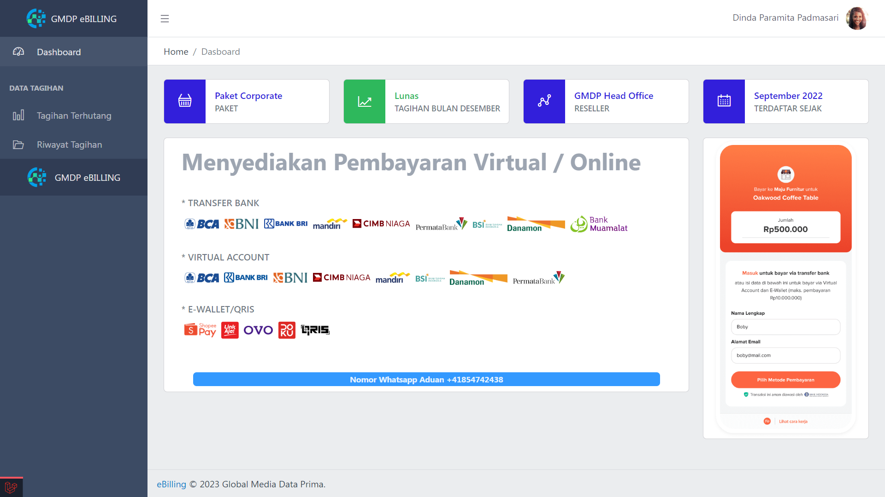
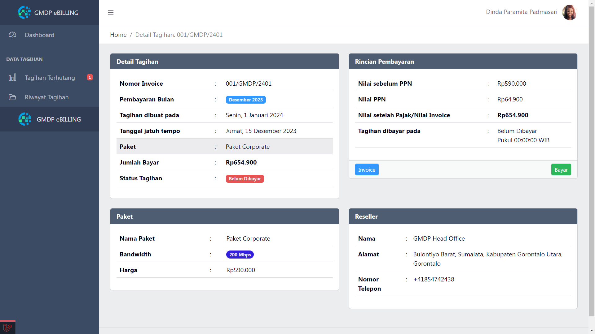

    <h1 align="center">Billing ISP</h1>

 

Pengunjung :

# Apa ini?
<h4 align="center">
Aplikasi Berbasis Website dengan fitur Pembayaran Tagihan, Pengelola Pelanggan, hingga Pelaporan pajak PPN, BHP / USO dan KSO yang sesuai dengan regulasi Indonesia untuk usaha INTERVET SERVICE PROVIDER / ISP
</h4>
 

# Pertanyaan
Q: Berapa Harganya untuk saya bisa memakai ebilling?  
A: <strong>GRATIS</strong>. dengan catatan, anda bermitra dengan <strong>PT. Global Media Data Prima</strong>  
Q: Bagaimana jika saya tidak bermitra dengan <strong>PT. Global Media Data Prima</strong>  
A: Kami akan segera menghadirkan ebilling versi public dengan harga yang terjangkau  
Q: Apakah fitur yang tersedia lengkap?  
A: Silahkan request fitur kepada kami, kami akan menghadirkan fitur yang diinginkan pengguna secara gratis tanpa biaya tambahan  

# INFO
#### Data yang kami tampilkan adalah data DUMMY atau PALSU
<table>
    <tr>
        <td></td>
        <td></td>
        <td></td>
    </tr>
</table>
<table>
    <tr>
        <td></td>
        <td></td>
        <td></td>
    </tr>
</table>
<table>
    <tr>
        <td></td>
        <td></td>
        <td></td>
    </tr>
</table>
<table>
    <tr>
        <td></td>
        <td></td>
        <td></td>
    </tr>
</table>
<table>
    <tr>
        <td></td>
        <td></td>
        <td></td>
    </tr>
</table>

# Features
- [X] Payment Gateway
- [X] Pisah Payemt Gateway di setiap Reseller
- [x] Koneksi Mikrotik
- [x] Pesan Otomatis Whatsapp (https://github.com/WhiskeySockets/Baileys)

# Website Components
- Laravel version 10.x
- Database PostgreSQL version 16
- Include Flip Service (FLIP REST API Client)
- Mikrotik RouterOS API PHP client (https://github.com/EvilFreelancer/routeros-api-php)
  
<table>
    <tr>
        <td></td>
        <td></td>
        <td></td>
        <td></td>
        <td></td>
    </tr>
</table>

# Contact

#### Silahkan Email ke `info@gmdp.net.id` untuk informasi lebih lengkap
